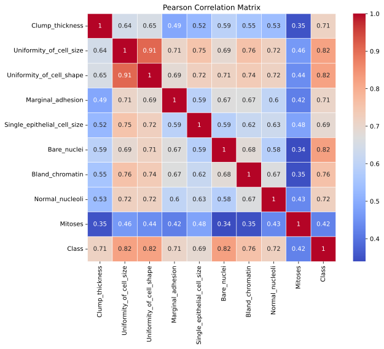
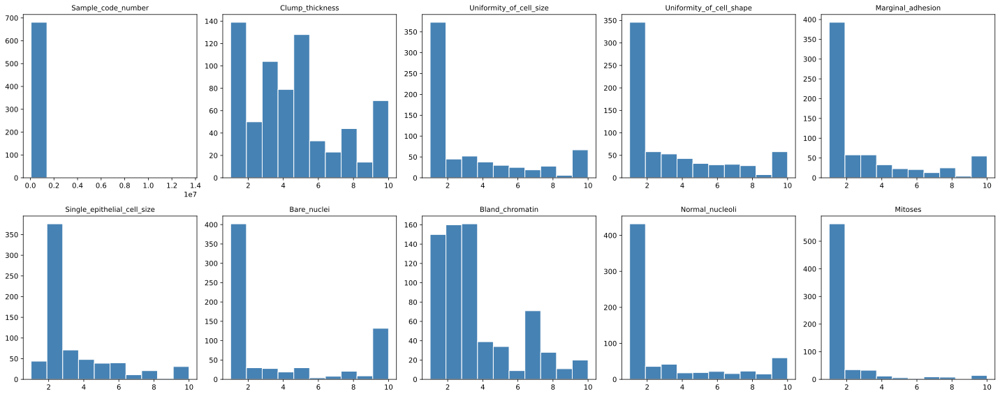
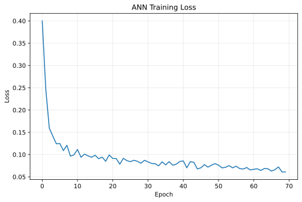
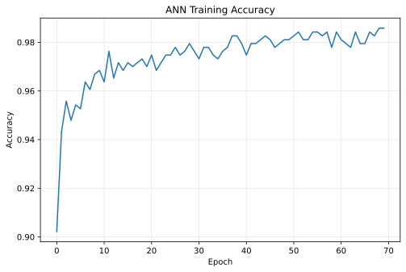
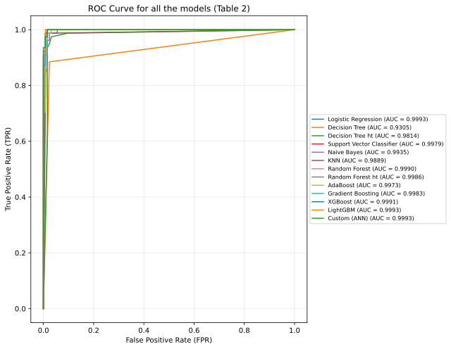
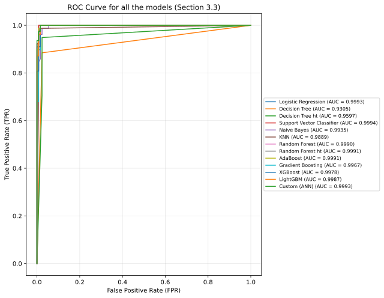

# Breast Cancer Diagnosis — Reproducing Jain et al. (2024)

A from-scratch reproduction of the machine learning pipeline described in:

> Jain, P., Aggarwal, S., Adam, S., & Imam, M. (2024). *Parametric optimization and comparative study of machine learning and deep learning algorithms for breast cancer diagnosis.* **Breast Disease, 43**, 257–270. [DOI: 10.3233/BD-240018](https://doi.org/10.3233/BD-240018)

This repository re-implements the paper's full pipeline on the **Wisconsin Breast Cancer (Original)** dataset: preprocessing, feature selection, SMOTE balancing, 10 classical ML models (+2 hyperparameter-tuned variants), 1 custom ANN, and full evaluation with ROC/AUC — then checks how closely the reproduced numbers land next to what the paper reports.

---

## 📋 Table of Contents

- [Breast Cancer Diagnosis — Reproducing Jain et al. (2024)](#breast-cancer-diagnosis--reproducing-jain-et-al-2024)
  - [📋 Table of Contents](#-table-of-contents)
  - [🔬 What this repository does](#-what-this-repository-does)
  - [🗂️ Dataset](#️-dataset)
  - [🛠️ Methodology](#️-methodology)
  - [⚠️ The Table 2 vs. Section 3.3 conflict](#️-the-table-2-vs-section-33-conflict)
  - [🔧 Deprecated / unavailable parameters](#-deprecated--unavailable-parameters)
  - [🤖 Models implemented](#-models-implemented)
  - [📊 Results](#-results)
  - [⚙️ Setup \& usage](#️-setup--usage)
  - [🧩 Known limitations (in the paper itself)](#-known-limitations-in-the-paper-itself)
  - [🏁 Conclusion](#-conclusion)
  - [📄 License](#-license)
  - [📚 Citation](#-citation)

---

## 🔬 What this repository does

The paper investigates which ML/DL models best distinguish **benign** vs **malignant** tumors on the UCI Wisconsin Breast Cancer (Original) dataset, and argues that (a) hyperparameter tuning consistently helps and (b) boosting algorithms (AdaBoost, Gradient Boost, XGBoost) are especially robust to the data's non-linearity.

This project reproduces that pipeline end-to-end in a single notebook (`breast_cancer_classification.ipynb`) so the paper's claims can be checked against an independent implementation, using the same dataset, the same preprocessing steps, and — as closely as the paper's text allows — the same hyperparameters.

## 🗂️ Dataset

**Wisconsin Breast Cancer (Original)**, fetched via [`ucimlrepo`](https://pypi.org/project/ucimlrepo/) (`id=15`):

- 699 instances total, 9 integer-valued features (after dropping the identifier column), labels `2` (benign) / `4` (malignant)
- `Bare_nuclei` has 16 missing values → those rows are dropped (matches the paper's final usable count of 683 instances, 444 benign / 239 malignant)
- 70/30 train/test split, `random_state=9`

## 🛠️ Methodology

Following the paper's Section 3.1–3.2:

1. **Drop `Sample_code_number`** — an identifier, not a feature.
2. **Drop missing rows** on `Bare_nuclei`.
3. **Feature selection**: `Uniformity_of_cell_shape` and `Uniformity_of_cell_size` are highly correlated (r = 0.91 in the correlation matrix) → `Uniformity_of_cell_shape` is dropped, as the paper describes.
<p align="center">
    
</p>

<p align="center">
    
</p>

4. **Train/test split**: 70/30.
5. **`StandardScaler`**: fit on train only, applied to both train and test.
6. **SMOTE**: applied *only* to the training set, to correct the benign/malignant class imbalance.
7. **11 classifiers** trained on the resampled/scaled training data, evaluated on the (scaled, *not* resampled) test set: Logistic Regression, Decision Tree (plain + tuned), Random Forest (plain + tuned), SVC, Naïve Bayes, KNN, AdaBoost, Gradient Boosting, XGBoost, LightGBM.
8. **1 custom ANN** (Keras/TensorFlow) matching the architecture in the paper's Fig. 4 / Table 3.
<div align="center">
  
  
</div>

9.  **Evaluation**: precision, F1, and accuracy per class, plus ROC/AUC across all models.

## ⚠️ The Table 2 vs. Section 3.3 conflict

This is the central complication in reproducing the paper faithfully — **the paper contradicts itself.** Table 2 ("Hyperparameter used in various models") lists one set of values per model. The prose in Section 3.3, describing the same models in the same order, lists a *different* set of values for almost every model. Neither section acknowledges the other exists.

| Model | Table 2 | Section 3.3 (prose) |
|---|---|---|
| Logistic Regression | `max_iter=3000` | `max_iter=5000` |
| Decision Tree (tuned) | `max_depth=4, min_samples_leaf=3, min_samples_split=5` | `max_depth=5, min_samples_leaf=1, min_samples_split=3` |
| SVC | `kernel='rbf', verbose=True` | `kernel='linear', verbose=False` |
| Naïve Bayes | `var_smoothing=1e-8` | `var_smoothing=2e-9` |
| KNN | `n_neighbors=6, weights='distance', metric='manhattan'` | `n_neighbors=5, weights='uniform', metric='minkowski'` |
| Random Forest (tuned) | `max_depth=3, min_samples_leaf=4, min_samples_split=4, n_estimators=80` | `max_depth=8, min_samples_leaf=1, min_samples_split=2, n_estimators=48` |
| AdaBoost | `algorithm='SAMME', learning_rate=0.05, n_estimators=70` | `algorithm='SAMME.R', learning_rate=0.1, n_estimators=200` |
| Gradient Boosting | `learning_rate=0.1, n_estimators=100` | `learning_rate=0.5, n_estimators=100` |
| XGBoost | `learning_rate=0.2, max_depth=2, n_estimators=60` | `learning_rate=0.4, max_depth=3, n_estimators=175` |
| LightGBM | `learning_rate=0.05, n_estimators=120, num_leaves=25` | `learning_rate=0.05, n_estimators=200, num_leaves=50` |

There is no way to know from the paper alone which set of values actually produced the numbers in **Table 4** (the reported results table).

**How this repo handles it:** rather than guessing which one is "correct," the notebook implements **both configurations independently**, end to end:

- Section 4 of the notebook → Table 2 hyperparameters → `results/results_table2.csv`
- Section 5 of the notebook → Section 3.3 hyperparameters → `results/results_section3.3.csv`

It then builds `results/accuracy_comparison.csv`, which lines up both reproductions against the paper's own reported accuracy per model and flags which configuration (`Table 2` or `Section 3.3`) landed closer to what the paper claims.

## 🔧 Deprecated / unavailable parameters

A few parameters from the paper no longer exist (or behave differently) in current library versions, so the notebook adapts them and comments on each substitution inline:

- **`RandomForestClassifier(max_features='auto')`** → removed in modern scikit-learn → replaced with `'sqrt'` (scikit-learn's own recommended equivalent).
- **`AdaBoostClassifier(algorithm='SAMME'/'SAMME.R')`** → the `algorithm` argument is deprecated; `SAMME` is now the only/default behavior, so the argument is simply omitted.
- **`GradientBoostingClassifier(criterion='mse')`** → `'mse'` was removed as a valid criterion; the notebook uses the current default instead.
- **XGBoost / LightGBM label encoding**: both libraries expect labels in `{0, 1}`, not the dataset's native `{2, 4}`, so class labels are remapped for those two models (and for the ANN) only.

## 🤖 Models implemented

| # | Model | Tuned variant included? |
|---|---|---|
| 1 | Logistic Regression | ❌ |
| 2 | Decision Tree | ✅ plain + tuned |
| 3 | Random Forest | ✅ plain + tuned |
| 4 | Support Vector Classifier | ❌ |
| 5 | Naïve Bayes (Gaussian) | ❌ |
| 6 | K-Nearest Neighbors | ❌ |
| 7 | AdaBoost | ❌ |
| 8 | Gradient Boosting | ❌ |
| 9 | XGBoost | ❌ |
| 10 | LightGBM | ✅ tuned |
| 11 | Custom ANN (Keras) | 2 hidden layers (10 → 5 neurons), ReLU + dropout(0.1), sigmoid output, Adam optimizer, 70 epochs, batch size 5 — per Fig. 4 / Table 3 |

## 📊 Results

All raw numbers live in `results/`, not hardcoded here, so they always reflect the latest run of the notebook:

- **`results/results_table2.csv`** — precision (benign/malignant), F1 (benign/malignant), and accuracy for all 11 models + ANN, using **Table 2** hyperparameters.
<p align="center">
    
</p>

- **`results/results_section3.3.csv`** — same metrics, using **Section 3.3** hyperparameters.
<p align="center">
    
</p>

- **`results/accuracy_comparison.csv`** — merges both reproductions against the paper's reported Table 4 accuracy, with an absolute-difference column for each configuration and a `Closer to Paper` verdict per model.

Open these three CSVs directly for the actual figures.

## ⚙️ Setup & usage

```bash
git clone https://github.com/amirmahdibita/breast-cancer-diagnosis-replication.git
cd breast-cancer-diagnosis-reproduction
pip install -r requirements.txt
jupyter notebook breast_cancer_classification.ipynb
```

Run all cells top to bottom — the notebook fetches the dataset live via `ucimlrepo`, so an internet connection is required on first run. All figures and result CSVs regenerate automatically into `figures/` and `results/`.

## 🧩 Known limitations (in the paper itself)

Worth flagging since they affect how much weight to put on any exact-match comparison:

- **The custom ANN cannot be unambiguously cross-referenced between sections.** Table 4 lists it only as "MLP — Custom Classifier," with no explicit link back to the architecture defined in Fig. 4 / Table 3. The paper's own discussion (Section 4) acknowledges this gap and notes that, as a result, the custom classifier's reported performance cannot be rigorously compared against the other models.
- **The Table 2 vs. Section 3.3 hyperparameter conflict is reported here as a methodological finding, not resolved by assumption.** Since the paper does not specify which configuration produced its published results, "the paper's hyperparameters" is not a single, well-defined quantity. This repository implements and reports both, so the discrepancy is visible and quantifiable.
- Random seeds, exact SMOTE neighbor counts, and library versions used by the original authors are not stated, so exact numeric reproduction (vs. close reproduction) isn't achievable even with identical hyperparameters.

## 🏁 Conclusion

The paper advances two central claims: (1) hyperparameter-tuned models outperform their untuned counterparts, and (2) boosting methods (AdaBoost, Gradient Boost, XGBoost) perform consistently well across benign and malignant classes, which the authors attribute to robustness against the non-linearity in this dataset. This repository provides an independent, empirical basis for evaluating both claims: `results/accuracy_comparison.csv` shows whether the tuned variants outperform their untuned counterparts under this reproduction, and `figures/roc_curves_table2.svg` / `figures/roc_curves_section3.3.svg` allow direct visual comparison of AUC clustering among the boosting models under each of the two hyperparameter configurations.

## 📄 License

See [`LICENSE`](./LICENSE).

## 📚 Citation

```bibtex
@article{jain2024parametric,
  title   = {Parametric optimization and comparative study of machine learning and
             deep learning algorithms for breast cancer diagnosis},
  author  = {Jain, Parul and Aggarwal, Shalini and Adam, Sufiyan and Imam, Mohsin},
  journal = {Breast Disease},
  volume  = {43},
  pages   = {257--270},
  year    = {2024},
  doi     = {10.3233/BD-240018}
}
```
